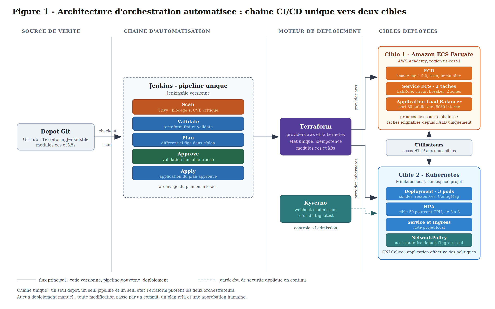

# Projet Orchestration - ECS et Kubernetes

Deploiement d'une meme application sur deux orchestrateurs : Amazon ECS Fargate et Kubernetes.
Les deux cibles sont decrites en Terraform et deployees par un pipeline Jenkins unique.

Auteurs : Issiakha et Lucas

## Architecture

## Prerequis

- Terraform
- Docker
- Minikube demarre avec le CNI Calico
- Jenkins installe sur la machine
- Un compte AWS Academy (region us-east-1)

## Structure du depot

- main.tf : appelle les deux modules
- providers.tf : providers aws et kubernetes
- outputs.tf : URL de l'ALB et infos Kubernetes
- Jenkinsfile : pipeline CI/CD
- app/ : Dockerfile de l'application
- modules/ecs/ : ECR, cluster Fargate, ALB, service
- modules/k8s/ : deployment, service, ingress, HPA, networkpolicy

## Deploiement manuel

Mettre les identifiants AWS dans ~/.aws/credentials, puis :

1. Creer le depot ECR en premier, car l'image doit exister avant le service.

   terraform init
   terraform apply -target=module.ecs.aws_ecr_repository.app

2. Construire et pousser l'image. Remplacer COMPTE par le numero de compte AWS.

   cd app
   docker build -t yokozuna-app:1.0.0 .
   aws ecr get-login-password --region us-east-1 | docker login --username AWS --password-stdin COMPTE.dkr.ecr.us-east-1.amazonaws.com
   docker tag yokozuna-app:1.0.0 COMPTE.dkr.ecr.us-east-1.amazonaws.com/yokozuna-app:1.0.0
   docker push COMPTE.dkr.ecr.us-east-1.amazonaws.com/yokozuna-app:1.0.0

3. Deployer les deux cibles.

   terraform apply

4. Ajouter le nom d'hote pour acceder a l'Ingress.

   echo "$(minikube ip) projet.local" >> /etc/hosts

## Deploiement par le pipeline Jenkins

Le pipeline fait la meme chose, avec un controle en plus.
Etapes : Scan avec Trivy, puis Validate, Plan, Approve et Apply.
Le build s'arrete a l'etape Approve. Rien n'est applique sans validation humaine.

Pour l'utiliser :

1. Creer un job Jenkins de type Pipeline.
2. Choisir "Pipeline script from SCM", Git, l'URL de ce depot, branche main.
3. Donner a l'utilisateur jenkins l'acces aux deux cibles.

   cp -r ~/.aws ~/.kube ~/.minikube /var/lib/jenkins/
   chown -R jenkins:jenkins /var/lib/jenkins/.aws /var/lib/jenkins/.kube /var/lib/jenkins/.minikube
   sed -i 's|/root/.minikube|/var/lib/jenkins/.minikube|g' /var/lib/jenkins/.kube/config

## Verification

   terraform output
   curl http://URL de alb/
   curl http://projet.local/
   kubectl get all -n projet

## Suppression

   terraform destroy

## Securite

- Les images ont un tag explicite, jamais latest.
- Le depot ECR est immutable avec un scan a chaque push.
- Trivy bloque le pipeline si l'image contient une faille critique.
- Kyverno refuse tout pod utilisant le tag latest.
- Une NetworkPolicy limite l'acces aux pods web depuis l'Ingress.
- Le fichier d'etat Terraform et les identifiants ne sont pas versionnes.
